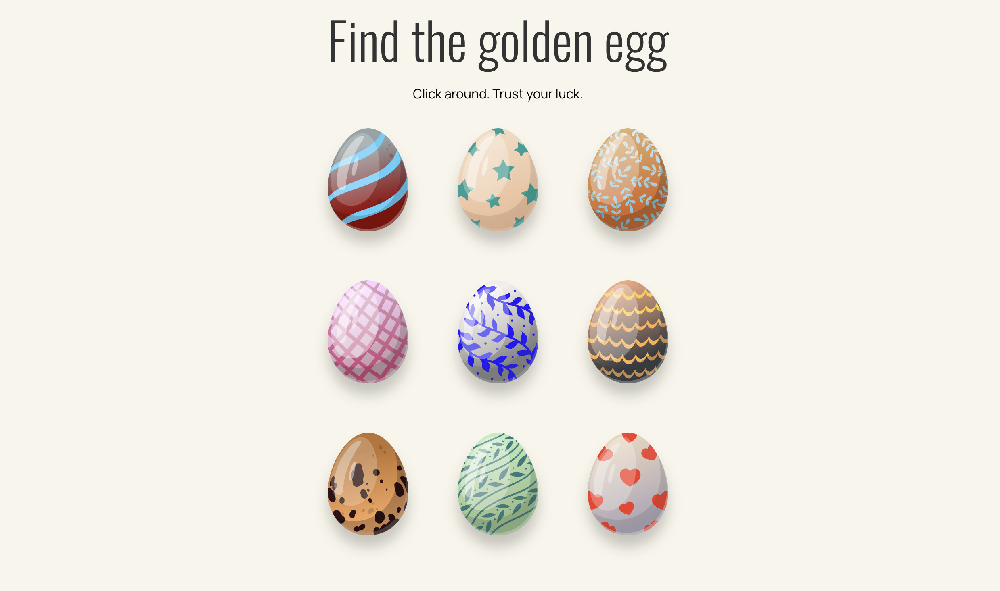

# Find the golden egg

## Description

A small interactive Easter game where you try to find a randomly placed golden egg with instant feedback on each click.

## Live Demo

https://8headswillroll8.github.io/find-the-golden-egg-game/

## Features

- Randomized winning egg on each page load
- Progressive feedback messages for wrong guesses
- Visual state changes for selected eggs
- Game over state with restart button

## How to Play

- Click an egg to make a guess
- Get feedback after each attempt
- Find the golden egg to win
- Click "Play again?" to restart

## What I Learned

- Handling click events on multiple elements
- Managing game state with variables
- Updating the DOM based on conditions
- Structuring small interactive applications

## Built With

- HTML5
- CSS3
- JavaScript
- VS Code

## Future Improvements

- Add animations for win/lose states
- Add score tracking based on number of attempts
- Add sound effects for feedback
